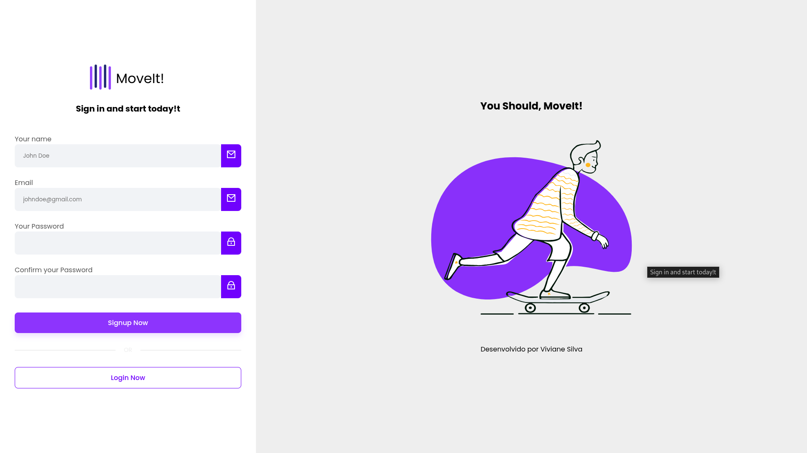

---

# 📱 **Login Page - Angular**

Este é um projeto de página de login desenvolvido em Angular, com base no design do Figma fornecido. O objetivo é criar uma interface de usuário simples, funcional e moderna para autenticação de usuários.

## 🔧 **Tecnologias Usadas**
### Front-end
<div style="display: inline_block"><br>
    
    
    
    
    
    
    
</div>

### Back-end


          
          
## 🏗 **Arquitetura**

O projeto segue uma arquitetura modular em Angular, separando componentes, serviços e módulos de maneira eficiente:

- **Módulos**: O projeto está dividido em módulos para garantir uma estrutura escalável.
- **Componentes**: Cada parte da interface (como o campo de login e os botões) está encapsulada em componentes individuais.
- **Serviços**: Responsáveis pela lógica de autenticação e integração com a API de backend (se necessário).

## 💻 **Como Rodar o Projeto**

### 1. Clone o repositório:
```bash
git clone https://github.com/vivianezzt/loginpage-angular.git
cd loginpage-angular
```

### 2. Instale as dependências:
```bash
npm install
```

### 3. Rode a aplicação:
```bash
ng serve
```

A aplicação estará disponível em `http://localhost:4200`.

## 🎨 **Design**

O design foi criado no Figma e pode ser acessado [aqui](https://www.figma.com/design/7T1wkErczpMOBeqtpVjMSb/Login-Page-Design?node-id=302-374&t=Gqo82RbQlhKYSJIb-0). Ele foca em simplicidade e usabilidade, com um layout limpo e intuitivo para a página de login.



## 🌐 **Deploy**

A aplicação está configurada para ser facilmente hospedada em plataformas como Vercel, Netlify ou qualquer servidor estático.

## ⚙️ **Funcionalidades**

- Página de login simples e moderna
- Responsiva para dispositivos móveis
- Validação de campos (email e senha)
- Interface com feedbacks de erro de forma clara

## 🔒 **Próximos Passos**

- Integrar com API de backend para autenticação de usuários.
- Implementar autenticação via OAuth ou JWT.
- Adicionar temas e animações para melhorar a UX.

## 📌 **Licença**

**MIT License**

**Copyright (c) Viviane Aguiar - 2025**
A licença MIT permite que qualquer pessoa use, copie, modifique, distribua e até venda o software, desde que mantenha o aviso de copyright e a permissão. O software é fornecido "como está", sem garantias, e os autores não são responsáveis por qualquer dano ou problema decorrente do uso do software.


---